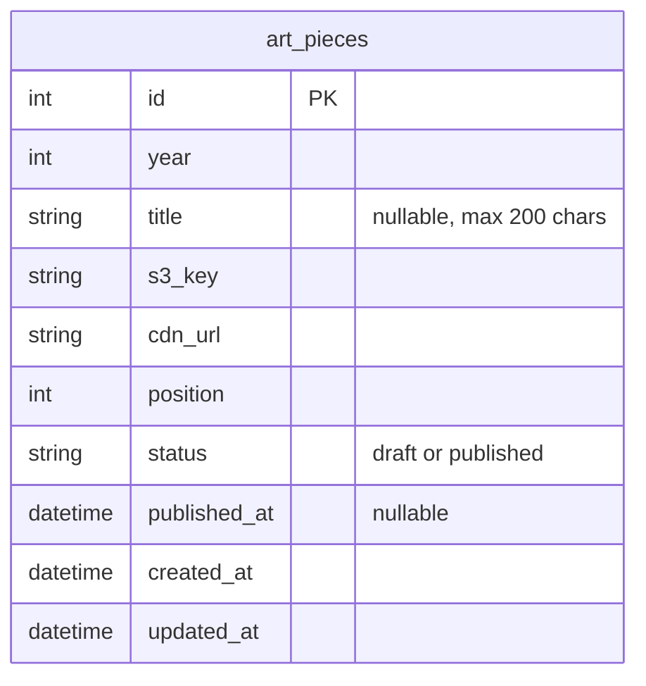

# Design Document: Emi's Art

## Overview

The Emi's Art feature adds a new section to emisofia.com where the author showcases Emi's artwork organized by year. It follows the same architectural patterns as the existing "Family Trips" feature: a FastAPI backend with SQLite for metadata, S3/CloudFront for photo storage, and a Next.js frontend with ISR (Incremental Static Regeneration) for public pages.

Key design goals:
- Reuse existing infrastructure (S3 bucket, CloudFront distribution, SQLite database, JWT auth, presign endpoint)
- Follow established code patterns (router structure, Pydantic schemas, SQLAlchemy models)
- Simpler data model than Trips: a single `ArtPiece` table with year grouping (no separate "year" entity)
- Reuse the existing `Lightbox` and `PhotoGallery` components (with minor enhancements for title display)
- Public routes: `/art` (year list) and `/art/[year]` (year gallery)
- CMS route: `/cms/art` (management view grouped by year)

## Architecture

```mermaid
graph TD
    subgraph Frontend [Next.js Frontend]
        A[/art page - Year List] -->|fetch| D[Public API]
        B[/art/year page - Year Gallery] -->|fetch| D
        C[/cms/art page] -->|fetch| E[CMS API]
        C -->|upload| F[Presign Endpoint]
    end

    subgraph Backend [FastAPI Backend]
        D[GET /api/art/years, GET /api/art/years/:year]
        E[POST/PUT/DELETE /api/cms/art]
        F[POST /api/cms/photos/presign]
    end

    subgraph Storage
        H[(SQLite DB)]
        I[S3 Bucket]
        J[CloudFront CDN]
    end

    D --> H
    E --> H
    E --> I
    F --> I
    J --> I
    B -->|img src| J
```

The architecture mirrors the Family Trips feature:
1. **Public pages** are server-rendered with 60-second ISR revalidation
2. **CMS pages** are client-rendered with JWT auth tokens stored in localStorage
3. **Photo upload** reuses the existing presigned URL endpoint (`/api/cms/photos/presign`)
4. **Photo serving** uses CloudFront CDN URLs stored in the database
5. **Photo deletion** reuses the existing delete endpoint (`/api/cms/photos/{key}`)

### Design Decisions

| Decision | Rationale |
|----------|-----------|
| Single `art_pieces` table (no separate Year entity) | Years are just an integer column — no metadata needed per year. Grouping is done via SQL `GROUP BY` / `DISTINCT`. |
| Position is per-year, not global | Art is browsed by year, so ordering only matters within a year. |
| Reuse existing `Lightbox` component with title prop | The existing Lightbox already handles navigation, keyboard, and accessibility. Adding an optional `title` prop is minimal. |
| No pagination on year list or year gallery | Art collections are small (tens of pieces per year, few years). Simple list responses suffice. |
| CMS is a single page with year-grouped view | Unlike trips (which have separate list/new/edit pages), art management is simpler — upload, reorder, edit title, delete — all on one page grouped by year. |

## Components and Interfaces

### Backend Components

#### 1. ArtPiece Model (`app/models.py`)

New SQLAlchemy model `ArtPiece` — a flat table with year as a grouping column.

#### 2. Art Schemas (`app/schemas.py`)

New Pydantic schemas for art CRUD operations:
- `ArtPieceCreate` — create request body (year, s3_key, cdn_url, title, position)
- `ArtPieceUpdate` — partial update request body (title, position, status)
- `ArtPieceBulkReorder` — reorder request body (list of id + position pairs)
- `ArtPieceOut` — public response item (id, cdn_url, title, position)
- `CmsArtPieceOut` — CMS response item (includes s3_key, status)
- `YearSummary` — year list item (year, cover_photo_url, count)

#### 3. Public Art Router (`app/routers/public_art.py`)

| Endpoint | Method | Description |
|----------|--------|-------------|
| `/api/art/years` | GET | List years with published art (newest first) |
| `/api/art/years/{year}` | GET | Get all published art pieces for a year |

#### 4. CMS Art Router (`app/routers/cms_art.py`)

| Endpoint | Method | Description |
|----------|--------|-------------|
| `/api/cms/art` | GET | List all art pieces grouped by year (drafts + published) |
| `/api/cms/art` | POST | Create a new art piece |
| `/api/cms/art/{art_id}` | PUT | Update an art piece (title, status) |
| `/api/cms/art/{art_id}` | DELETE | Delete an art piece + S3 cleanup + re-sequence |
| `/api/cms/art/reorder` | PUT | Bulk reorder art pieces within a year |

All CMS endpoints require JWT authentication via `get_current_author` dependency.

#### 5. Photo Management

Reuses the existing `cms_photos` router for presigned URL generation (`POST /api/cms/photos/presign`) and S3 deletion (`DELETE /api/cms/photos/{key}`). The S3 key pattern remains `photos/{year}/{uuid}.{ext}`.

### Frontend Components

#### 1. Public Pages

| Route | Component | Description |
|-------|-----------|-------------|
| `/art` | `ArtYearsPage` | Server-rendered list of years with cover thumbnails |
| `/art/[year]` | `ArtYearGalleryPage` | Server-rendered gallery grid for a year with lightbox |

#### 2. CMS Pages

| Route | Component | Description |
|-------|-----------|-------------|
| `/cms/art` | `CmsArtPage` | Client-rendered management view grouped by year |

#### 3. Shared UI Components (Reused)

| Component | Modification |
|-----------|-------------|
| `Lightbox` | Add optional `title?: string` to photo interface; render title below image when present |
| `PhotoGallery` | Add optional `title?: string` to photo interface; render title below thumbnail when present |

#### 4. New UI Components

| Component | Description |
|-----------|-------------|
| `ArtUploader` | Upload widget for CMS — file picker with JPEG/PNG + 10MB validation |
| `ArtYearSection` | CMS year group with drag-and-drop reorder, inline title editing |

### API Interfaces

#### Public: List Years

```
GET /api/art/years

Response 200:
[
  {
    "year": 2025,
    "cover_photo_url": "https://cdn.example.com/photos/2025/abc.jpg",
    "count": 8
  },
  {
    "year": 2024,
    "cover_photo_url": "https://cdn.example.com/photos/2024/def.jpg",
    "count": 12
  }
]
```

#### Public: Get Year Gallery

```
GET /api/art/years/2025

Response 200:
[
  {
    "id": 1,
    "cdn_url": "https://cdn.example.com/photos/2025/abc.jpg",
    "title": "Butterfly painting",
    "position": 1
  },
  {
    "id": 2,
    "cdn_url": "https://cdn.example.com/photos/2025/def.jpg",
    "title": null,
    "position": 2
  }
]
```

#### CMS: List All Art (Grouped by Year)

```
GET /api/cms/art
Authorization: Bearer <token>

Response 200:
[
  {
    "year": 2025,
    "pieces": [
      {
        "id": 1,
        "s3_key": "photos/2025/abc.jpg",
        "cdn_url": "https://cdn.example.com/photos/2025/abc.jpg",
        "title": "Butterfly painting",
        "position": 1,
        "status": "published"
      },
      {
        "id": 3,
        "s3_key": "photos/2025/ghi.jpg",
        "cdn_url": "https://cdn.example.com/photos/2025/ghi.jpg",
        "title": null,
        "position": 2,
        "status": "draft"
      }
    ]
  }
]
```

#### CMS: Create Art Piece

```
POST /api/cms/art
Authorization: Bearer <token>

{
  "year": 2025,
  "s3_key": "photos/2025/abc.jpg",
  "cdn_url": "https://cdn.example.com/photos/2025/abc.jpg",
  "title": "Butterfly painting"
}

Response 201:
{
  "id": 1,
  "year": 2025,
  "s3_key": "photos/2025/abc.jpg",
  "cdn_url": "https://cdn.example.com/photos/2025/abc.jpg",
  "title": "Butterfly painting",
  "position": 1,
  "status": "draft"
}
```

#### CMS: Update Art Piece

```
PUT /api/cms/art/1
Authorization: Bearer <token>

{
  "title": "Updated title",
  "status": "published"
}

Response 200: CmsArtPieceOut
```

#### CMS: Delete Art Piece

```
DELETE /api/cms/art/1
Authorization: Bearer <token>

Response 204 No Content
```

Side effects: deletes S3 object, re-sequences positions for remaining pieces in that year.

#### CMS: Bulk Reorder

```
PUT /api/cms/art/reorder
Authorization: Bearer <token>

{
  "year": 2025,
  "order": [3, 1, 2]
}

Response 200:
[CmsArtPieceOut, ...]
```

The `order` array contains art piece IDs in the desired display order. The backend assigns position 1, 2, 3, ... based on array index.

## Data Models

### Database Schema



### SQLAlchemy Model

```python
class ArtPiece(Base):
    __tablename__ = "art_pieces"

    id: Mapped[int] = mapped_column(Integer, primary_key=True, autoincrement=True)
    year: Mapped[int] = mapped_column(Integer, nullable=False, index=True)
    title: Mapped[str | None] = mapped_column(String(200), nullable=True)
    s3_key: Mapped[str] = mapped_column(String(512), nullable=False)
    cdn_url: Mapped[str] = mapped_column(String(1024), nullable=False)
    position: Mapped[int] = mapped_column(Integer, nullable=False)
    status: Mapped[str] = mapped_column(String(10), nullable=False, default="draft")
    published_at: Mapped[datetime | None] = mapped_column(DateTime, nullable=True)
    created_at: Mapped[datetime] = mapped_column(DateTime, nullable=False, default=_now)
    updated_at: Mapped[datetime] = mapped_column(DateTime, nullable=False, default=_now, onupdate=_now)
```

### Pydantic Schemas

```python
class ArtPieceCreate(BaseModel):
    year: int = Field(ge=2020, le=2030)  # upper bound validated dynamically
    s3_key: str
    cdn_url: str
    title: str | None = Field(default=None, max_length=200)

class ArtPieceUpdate(BaseModel):
    title: str | None = Field(default=None, max_length=200)
    status: Literal["draft", "published"] | None = None

class ArtPieceBulkReorder(BaseModel):
    year: int = Field(ge=2020, le=2030)
    order: list[int] = Field(min_length=1)  # list of art piece IDs in desired order

class ArtPieceOut(BaseModel):
    model_config = ConfigDict(from_attributes=True)
    id: int
    cdn_url: str
    title: str | None = None
    position: int

class CmsArtPieceOut(BaseModel):
    model_config = ConfigDict(from_attributes=True)
    id: int
    year: int
    s3_key: str
    cdn_url: str
    title: str | None = None
    position: int
    status: str

class YearSummary(BaseModel):
    year: int
    cover_photo_url: str | None = None
    count: int

class CmsYearGroup(BaseModel):
    year: int
    pieces: list[CmsArtPieceOut]
```

### Alembic Migration

A new migration will add the `art_pieces` table. The migration depends on the existing `b3f8a2c71d4e_add_trips_and_trip_photos` revision.

## Correctness Properties

*A property is a characteristic or behavior that should hold true across all valid executions of a system — essentially, a formal statement about what the system should do. Properties serve as the bridge between human-readable specifications and machine-verifiable correctness guarantees.*

### Property 1: Year list filtering and ordering

*For any* set of art pieces with arbitrary years and statuses (draft/published), the public year list endpoint SHALL return only years that contain at least one published art piece, and those years SHALL be ordered from newest to oldest.

**Validates: Requirements 1.3, 1.6**

### Property 2: Cover piece selection

*For any* year group containing multiple published art pieces with arbitrary position values, the cover photo URL in the year list SHALL be the CDN URL of the published art piece with the lowest position value in that year.

**Validates: Requirements 1.5**

### Property 3: Year gallery filtering and ordering

*For any* year containing art pieces with mixed statuses and arbitrary position values, the public year gallery endpoint SHALL return only published art pieces, and those pieces SHALL be ordered by position value ascending.

**Validates: Requirements 1.7, 3.2**

### Property 4: Art piece field validation

*For any* year value between 2020 and the current calendar year (inclusive), it SHALL be accepted as valid; for any year outside that range, it SHALL be rejected. *For any* title string of 0 to 200 characters, it SHALL be accepted; for any title exceeding 200 characters, it SHALL be rejected.

**Validates: Requirements 2.1, 2.5, 2.6**

### Property 5: Lightbox navigation wraps correctly

*For any* gallery of N art pieces (N ≥ 1) and any current index i (0 ≤ i < N), navigating "next" SHALL produce index (i + 1) % N, and navigating "previous" SHALL produce index (i - 1 + N) % N.

**Validates: Requirements 4.4, 4.5**

### Property 6: Position contiguity after mutations

*For any* year group with N art pieces, after any mutation (create, delete, or reorder), the position values of all art pieces in that year SHALL form a contiguous sequence of integers from 1 to M (where M is the resulting count of pieces in that year).

**Validates: Requirements 5.5, 5.7, 6.2**

### Property 7: CMS endpoints require authentication

*For any* CMS art endpoint (create, list, update, delete, reorder), a request without a valid JWT token SHALL receive a 401 Unauthorized response without exposing art data.

**Validates: Requirements 6.9**

## Error Handling

### Backend Errors

| Scenario | HTTP Status | Response |
|----------|-------------|----------|
| Art piece not found | 404 | `{"detail": "Art piece not found"}` |
| Year not found (no published pieces) | 200 | Empty array `[]` |
| Validation error (title too long, year out of range) | 422 | Pydantic validation error detail |
| Unauthorized (no/invalid JWT) | 401 | `{"detail": "Not authenticated"}` |
| S3 upload failure | 500 | `{"detail": "Photo upload failed"}` |
| Reorder with invalid IDs | 400 | `{"detail": "Invalid art piece IDs for the specified year"}` |

### Frontend Error Handling

- **API fetch failures**: Display a user-friendly error message with retry option
- **Photo upload failures**: Show error status on the upload widget, allow retry
- **File validation**: Inline rejection for non-JPEG/PNG files or files exceeding 10 MB (before upload attempt)
- **Form validation**: Inline error for title exceeding 200 characters, year out of range
- **Image load failure**: Display a placeholder icon within the gallery grid (graceful degradation when CDN is unreachable)

### S3 Cleanup Strategy

When deleting an art piece, the backend:
1. Deletes the S3 object (best-effort, log errors but don't block)
2. Removes the database record
3. Re-sequences positions for remaining pieces in that year

This matches the existing pattern in `cms_trips.py` where S3 is treated as eventually consistent and orphaned objects are acceptable over data integrity issues.

## Testing Strategy

### Property-Based Tests (Backend — Python with Hypothesis)

Property-based testing is appropriate for this feature because:
- Year list filtering/ordering, field validation, and position logic are pure functions with clear input/output behavior
- The input space is large (arbitrary years, titles, position permutations, status combinations)
- Universal properties hold across all valid inputs

**Library**: [Hypothesis](https://hypothesis.readthedocs.io/) for Python

**Configuration**: Minimum 100 iterations per property test

Each property test will be tagged with:
```python
# Feature: emis-art, Property {N}: {property_text}
```

Properties to implement as backend tests:
1. Year list filtering and ordering (Property 1)
2. Cover piece selection (Property 2)
3. Year gallery filtering and ordering (Property 3)
4. Art piece field validation (Property 4)
5. Position contiguity after mutations (Property 6)
6. CMS endpoints require authentication (Property 7)

### Property-Based Tests (Frontend — TypeScript with fast-check)

**Library**: [fast-check](https://fast-check.dev/) for TypeScript

Property 5 (lightbox navigation wrapping) is a frontend concern and will be tested with fast-check in the Next.js test suite, reusing the existing Lightbox test patterns.

### Unit Tests (Example-Based)

- Create art piece returns 201 with status "draft" and correct position
- Art piece with no title returns null title in response
- Art piece with title returns title in response
- Empty year list returns empty array
- Year gallery for year with no published pieces returns empty array
- Delete art piece returns 204 and removes from DB
- Publish art piece sets published_at timestamp
- Default status is "draft" when not specified

### Integration Tests

- Presigned URL generation returns valid S3 URL structure (reuses existing test)
- Art piece publish → appears in public year gallery endpoint
- Art piece delete → S3 delete_object called for the piece's key
- Full lifecycle: create draft → edit title → publish → verify public → delete
- Reorder → verify positions updated correctly in DB

### Frontend Tests

- `ArtYearsPage` renders year cards with cover thumbnails
- `ArtYearGalleryPage` renders responsive grid (3 cols ≥768px, 2 cols below)
- Gallery thumbnails are square (aspect-square + object-cover)
- Lightbox opens on thumbnail click, displays title when present
- Lightbox keyboard navigation (Escape, ArrowLeft, ArrowRight)
- Lightbox focus trapping and aria-modal attribute
- CMS art page groups pieces by year, shows status badges
- CMS upload validates file type (JPEG/PNG only) and size (≤10 MB)
- CMS title input enforces 200-character limit
- Homepage card links to /art with violet styling (not grayed out)
- Navigation bar link to /art with violet styling
