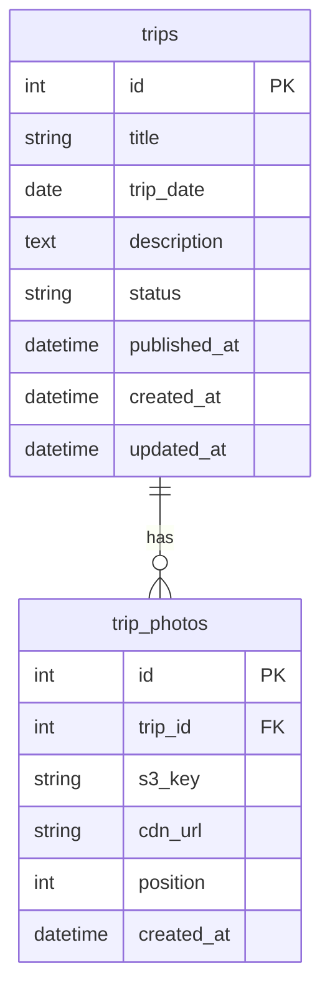

# Design Document: Family Trips

## Overview

The Family Trips feature adds a new section to emisofia.com where the author documents family trips with photos and descriptions. It follows the same architectural patterns as the existing "Notes for Emi" feature: a FastAPI backend with SQLite for metadata, S3/CloudFront for photo storage, and a Next.js frontend with server-side rendering and ISR (Incremental Static Regeneration).

Key design goals:
- Reuse existing infrastructure (S3 bucket, CloudFront distribution, SQLite database, JWT auth)
- Follow established code patterns (router structure, Pydantic schemas, SQLAlchemy models)
- Provide a public trip list and detail view with a responsive photo gallery and lightbox
- Provide CMS management with drag-and-drop photo reordering and presigned upload

## Architecture

```mermaid
graph TD
    subgraph Frontend [Next.js Frontend]
        A[/trips page] -->|fetch| D[Public API]
        B[/trips/:id page] -->|fetch| D
        C[/cms/trips pages] -->|fetch| E[CMS API]
        C -->|upload| F[S3 Presigned URL]
    end

    subgraph Backend [FastAPI Backend]
        D[GET /api/trips, GET /api/trips/:id]
        E[POST/PUT/DELETE /api/cms/trips]
        G[POST /api/cms/photos/presign]
    end

    subgraph Storage
        H[(SQLite DB)]
        I[S3 Bucket]
        J[CloudFront CDN]
    end

    D --> H
    E --> H
    E --> I
    G --> I
    J --> I
    B -->|img src| J
```

The architecture mirrors the Notes feature:
1. **Public pages** are server-rendered with 60-second ISR revalidation
2. **CMS pages** are client-rendered with JWT auth tokens stored in memory/localStorage
3. **Photo upload** uses the existing presigned URL endpoint (`/api/cms/photos/presign`)
4. **Photo serving** uses CloudFront CDN URLs stored in the database
5. **Photo deletion** uses the existing delete endpoint (`/api/cms/photos/{key}`)

## Components and Interfaces

### Backend Components

#### 1. Trip Model (`app/models.py`)

New SQLAlchemy model `Trip` with a one-to-many relationship to a new `TripPhoto` model.

#### 2. Trip Schemas (`app/schemas.py`)

New Pydantic schemas for trip CRUD operations:
- `TripCreate` — create request body
- `TripUpdate` — partial update request body
- `TripListItem` — public list response item
- `TripDetail` — public detail response
- `CmsTripDetail` — CMS detail response (includes drafts)
- `TripPhotoIn` — photo reference input
- `TripPhotoOut` — photo reference output

#### 3. Public Trips Router (`app/routers/public_trips.py`)

| Endpoint | Method | Description |
|----------|--------|-------------|
| `/api/trips` | GET | List published trips (paginated, newest first) |
| `/api/trips/{trip_id}` | GET | Get single published trip with photos |

#### 4. CMS Trips Router (`app/routers/cms_trips.py`)

| Endpoint | Method | Description |
|----------|--------|-------------|
| `/api/cms/trips` | POST | Create a new trip |
| `/api/cms/trips` | GET | List all trips (drafts + published) |
| `/api/cms/trips/{trip_id}` | GET | Get single trip (any status) |
| `/api/cms/trips/{trip_id}` | PUT | Update a trip |
| `/api/cms/trips/{trip_id}` | DELETE | Delete a trip + S3 photos |

All CMS endpoints require JWT authentication via `get_current_author` dependency.

#### 5. Photo Management

Reuses the existing `cms_photos` router for presigned URL generation and S3 deletion. The S3 key pattern remains `photos/{year}/{uuid}.{ext}`.

### Frontend Components

#### 1. Public Pages

| Route | Component | Description |
|-------|-----------|-------------|
| `/trips` | `TripsPage` | Server-rendered list of published trips |
| `/trips/[id]` | `TripDetailPage` | Server-rendered trip detail with gallery |

#### 2. CMS Pages

| Route | Component | Description |
|-------|-----------|-------------|
| `/cms/trips` | `CmsTripsPage` | List all trips with status badges |
| `/cms/trips/new` | `CmsNewTripPage` | Create trip form |
| `/cms/trips/[id]/edit` | `CmsEditTripPage` | Edit trip form |

#### 3. Shared UI Components

| Component | Description |
|-----------|-------------|
| `PhotoGallery` | Responsive grid of square thumbnails |
| `Lightbox` | Modal overlay with photo navigation and keyboard controls |
| `PhotoUploader` | Drag-and-drop upload with progress, reorder, and remove |
| `TripForm` | Shared form for create/edit with validation |

### API Interfaces

#### Public: List Trips

```
GET /api/trips?page=1&page_size=20

Response 200:
{
  "total": 5,
  "page": 1,
  "page_size": 20,
  "items": [
    {
      "id": 1,
      "title": "Beach Day",
      "trip_date": "2025-07-15",
      "cover_photo_url": "https://cdn.example.com/photos/2025/abc.jpg"
    }
  ]
}
```

#### Public: Get Trip Detail

```
GET /api/trips/1

Response 200:
{
  "id": 1,
  "title": "Beach Day",
  "trip_date": "2025-07-15",
  "description": "A wonderful day at the beach...",
  "photos": [
    { "cdn_url": "https://cdn.example.com/photos/2025/abc.jpg", "position": 1 },
    { "cdn_url": "https://cdn.example.com/photos/2025/def.jpg", "position": 2 }
  ]
}
```

#### CMS: Create Trip

```
POST /api/cms/trips
Authorization: Bearer <token>

{
  "title": "Beach Day",
  "trip_date": "2025-07-15",
  "description": "A wonderful day...",
  "status": "draft",
  "photos": [
    { "s3_key": "photos/2025/abc.jpg", "cdn_url": "https://cdn...", "position": 1 }
  ]
}

Response 201: CmsTripDetail
```

#### CMS: Update Trip

```
PUT /api/cms/trips/1
Authorization: Bearer <token>

{
  "title": "Beach Day Updated",
  "photos": [
    { "s3_key": "photos/2025/abc.jpg", "cdn_url": "https://cdn...", "position": 1 },
    { "s3_key": "photos/2025/def.jpg", "cdn_url": "https://cdn...", "position": 2 }
  ]
}

Response 200: CmsTripDetail
```

#### CMS: Delete Trip

```
DELETE /api/cms/trips/1
Authorization: Bearer <token>

Response 204 No Content
```

## Data Models

### Database Schema



### SQLAlchemy Models

```python
class Trip(Base):
    __tablename__ = "trips"

    id: Mapped[int] = mapped_column(Integer, primary_key=True, autoincrement=True)
    title: Mapped[str] = mapped_column(String(150), nullable=False)
    trip_date: Mapped[date] = mapped_column(Date, nullable=False)
    description: Mapped[str | None] = mapped_column(Text, nullable=True)
    status: Mapped[str] = mapped_column(String(10), nullable=False, default="draft")
    published_at: Mapped[datetime | None] = mapped_column(DateTime, nullable=True)
    created_at: Mapped[datetime] = mapped_column(DateTime, nullable=False, default=_now)
    updated_at: Mapped[datetime] = mapped_column(DateTime, nullable=False, default=_now, onupdate=_now)

    photos: Mapped[list["TripPhoto"]] = relationship(
        "TripPhoto", back_populates="trip", cascade="all, delete-orphan"
    )


class TripPhoto(Base):
    __tablename__ = "trip_photos"

    id: Mapped[int] = mapped_column(Integer, primary_key=True, autoincrement=True)
    trip_id: Mapped[int] = mapped_column(
        Integer, ForeignKey("trips.id", ondelete="CASCADE"), nullable=False
    )
    s3_key: Mapped[str] = mapped_column(String(512), nullable=False)
    cdn_url: Mapped[str] = mapped_column(String(1024), nullable=False)
    position: Mapped[int] = mapped_column(Integer, nullable=False)
    created_at: Mapped[datetime] = mapped_column(DateTime, nullable=False, default=_now)

    trip: Mapped["Trip"] = relationship("Trip", back_populates="photos")
```

### Pydantic Schemas

```python
class TripPhotoIn(BaseModel):
    s3_key: str
    cdn_url: str
    position: int = Field(ge=1, le=20)

class TripPhotoOut(BaseModel):
    cdn_url: str
    position: int

class TripCreate(BaseModel):
    title: str = Field(min_length=1, max_length=150)
    trip_date: date
    description: str | None = Field(default=None, max_length=2000)
    status: Literal["draft", "published"] = "draft"
    photos: list[TripPhotoIn] = Field(default=[], max_length=20)

class TripUpdate(BaseModel):
    title: str | None = Field(default=None, min_length=1, max_length=150)
    trip_date: date | None = None
    description: str | None = Field(default=None, max_length=2000)
    status: Literal["draft", "published"] | None = None
    photos: list[TripPhotoIn] | None = Field(default=None, max_length=20)

class TripListItem(BaseModel):
    id: int
    title: str
    trip_date: date
    cover_photo_url: str | None = None

class TripDetail(BaseModel):
    id: int
    title: str
    trip_date: date
    description: str | None = None
    photos: list[TripPhotoOut]

class CmsTripDetail(BaseModel):
    id: int
    title: str
    trip_date: date
    description: str | None = None
    status: str
    published_at: datetime | None = None
    photos: list[TripPhotoOut]
```

### Alembic Migration

A new migration will add the `trips` and `trip_photos` tables. The migration depends on the existing `0a32561a475e_initial_schema` revision.


## Correctness Properties

*A property is a characteristic or behavior that should hold true across all valid executions of a system — essentially, a formal statement about what the system should do. Properties serve as the bridge between human-readable specifications and machine-verifiable correctness guarantees.*

### Property 1: Trip list ordering

*For any* set of published trips with arbitrary trip dates and creation times, the public trip list endpoint SHALL return them ordered by trip_date descending, with ties broken by created_at descending.

**Validates: Requirements 1.2, 1.3**

### Property 2: Trip list items contain required fields

*For any* published trip with at least one photo, the corresponding trip list item SHALL include the trip's title, trip_date, and the CDN URL of the first photo (position 1) as cover_photo_url.

**Validates: Requirements 1.5**

### Property 3: Trip detail contains required fields

*For any* published trip, the trip detail response SHALL include the trip's title, trip_date, description (if present), and all attached photos with their CDN URLs and positions.

**Validates: Requirements 1.7**

### Property 4: Trip field validation

*For any* string of length 1 to 150, it SHALL be accepted as a valid trip title; for any string of length 0 or greater than 150, it SHALL be rejected. For any string of length 0 to 2000, it SHALL be accepted as a valid description; for any string longer than 2000, it SHALL be rejected. For any photo list of length 0 to 20, it SHALL be accepted; for any list longer than 20, it SHALL be rejected.

**Validates: Requirements 2.1, 2.4, 2.5, 5.1, 5.3**

### Property 5: Photos returned in position order

*For any* trip with photos assigned arbitrary position values, the trip detail endpoint SHALL return photos sorted by position ascending.

**Validates: Requirements 3.2**

### Property 6: Lightbox navigation wraps correctly

*For any* gallery of N photos (N ≥ 1) and any current index i (0 ≤ i < N), navigating "next" SHALL produce index (i + 1) % N, and navigating "previous" SHALL produce index (i - 1 + N) % N.

**Validates: Requirements 4.4, 4.5**

### Property 7: Photo reorder produces sequential positions

*For any* trip with N photos and any permutation of those photos, after applying the reorder operation, the resulting position values SHALL be exactly the sequence 1, 2, ..., N matching the new visual order.

**Validates: Requirements 5.6**

### Property 8: CMS endpoints require authentication

*For any* CMS trip endpoint (create, list, get, update, delete), a request without a valid JWT token SHALL receive a 401 Unauthorized response.

**Validates: Requirements 6.10**

## Error Handling

### Backend Errors

| Scenario | HTTP Status | Response |
|----------|-------------|----------|
| Trip not found | 404 | `{"detail": "Trip not found"}` |
| Validation error (title too long, etc.) | 422 | Pydantic validation error detail |
| Unauthorized (no/invalid JWT) | 401 | `{"detail": "Not authenticated"}` |
| S3 upload failure | 500 | `{"detail": "Photo upload failed"}` |
| S3 deletion failure during trip delete | 500 | `{"detail": "Failed to delete photos"}` |

### Frontend Error Handling

- **API fetch failures**: Display a user-friendly error message with retry option
- **Photo upload failures**: Show per-file error status, allow retry of failed uploads
- **Form validation**: Inline validation messages for title length, description length, and photo count
- **Lightbox image load failure**: Display a broken-image placeholder within the lightbox

### S3 Cleanup Strategy

When deleting a trip, the backend iterates over all associated `TripPhoto` records and deletes each S3 object. If any S3 deletion fails:
- Log the error with the S3 key for manual cleanup
- Continue deleting remaining photos (best-effort)
- Still delete the database records (photos become orphaned in S3 rather than keeping stale DB records)

This matches the existing pattern where S3 is treated as eventually consistent storage and orphaned objects are acceptable over data integrity issues in the database.

## Testing Strategy

### Property-Based Tests (Backend — Python with Hypothesis)

Property-based testing is appropriate for this feature because:
- Trip ordering, validation, and photo position logic are pure functions with clear input/output behavior
- The input space is large (arbitrary strings, dates, photo counts, permutations)
- Universal properties hold across all valid inputs

**Library**: [Hypothesis](https://hypothesis.readthedocs.io/) for Python

**Configuration**: Minimum 100 iterations per property test

Each property test will be tagged with:
```python
# Feature: family-trips, Property {N}: {property_text}
```

Properties to implement:
1. Trip list ordering (Property 1)
2. Trip list items contain required fields (Property 2)
3. Trip detail contains required fields (Property 3)
4. Trip field validation (Property 4)
5. Photos returned in position order (Property 5)
6. Lightbox navigation wraps (Property 6) — implemented in TypeScript with fast-check
7. Photo reorder produces sequential positions (Property 7)
8. CMS endpoints require authentication (Property 8)

### Property-Based Tests (Frontend — TypeScript with fast-check)

**Library**: [fast-check](https://fast-check.dev/) for TypeScript

Property 6 (lightbox navigation) is a frontend concern and will be tested with fast-check in the Next.js test suite.

### Unit Tests (Example-Based)

- Trip creation with valid data returns 201
- Trip creation as draft does not appear in public list
- Trip with no photos returns null cover_photo_url
- Empty trip list returns empty items array
- Description with paragraph breaks is preserved in detail response
- Delete trip returns 204 and removes from DB
- Edit published trip updates fields correctly

### Integration Tests

- Presigned URL generation returns valid S3 URL structure
- Trip publish → appears in public list endpoint
- Trip delete → S3 delete_object called for each photo key
- Full CRUD lifecycle: create draft → edit → publish → verify public → delete

### Frontend Tests

- PhotoGallery renders correct number of images
- Lightbox opens on photo click, closes on Escape/close button
- Keyboard navigation (arrow keys) works in lightbox
- TripForm validates title length and shows error
- PhotoUploader enforces 20-photo limit and file type restrictions
- Responsive grid: 3+ columns at ≥768px, 2 columns below
