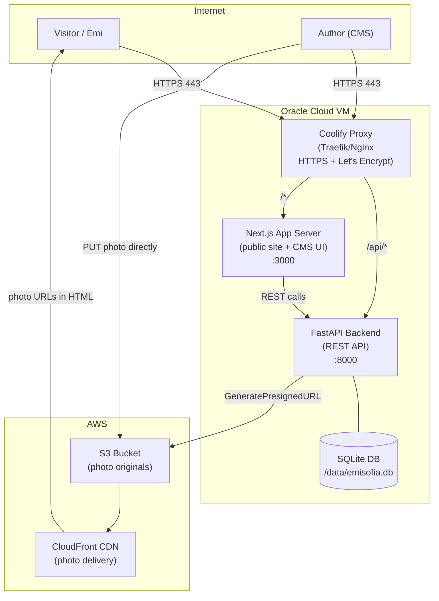
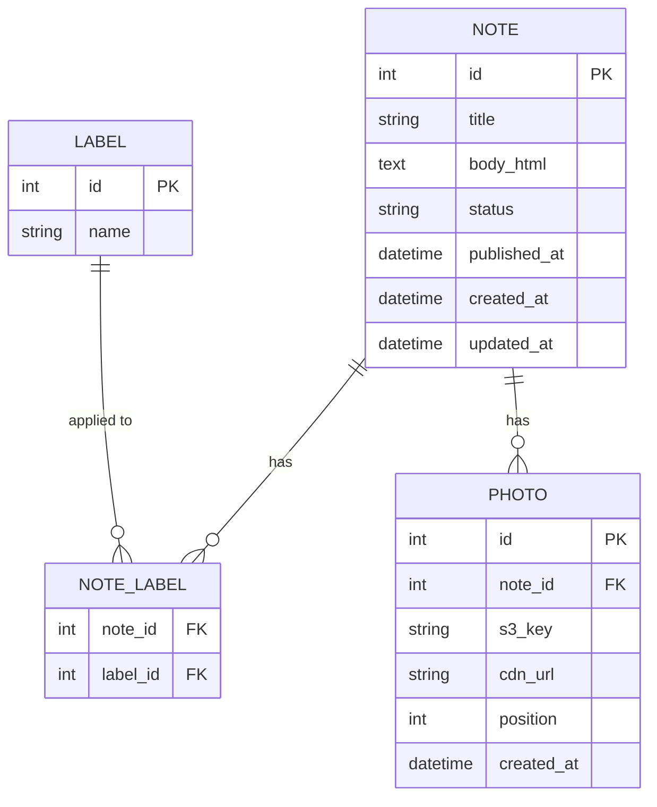
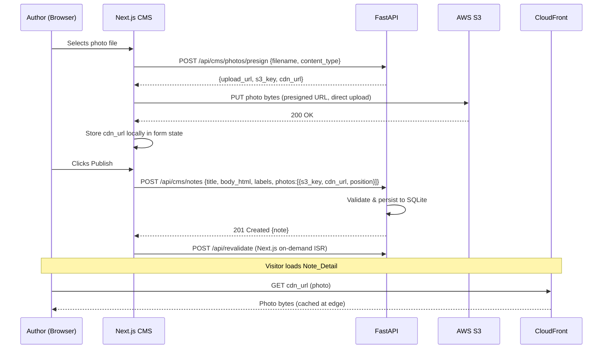

# Design Document: Notes for Emi

## Overview

"Notes for Emi" is the first section of a personal website at emisofia.com where a father writes notes to his daughter. The system has two distinct surfaces:

- **Public site** — a read-only, unauthenticated view where any visitor can browse and read notes.
- **CMS** — a password-protected authoring interface where only the author can create, edit, publish, and delete notes.

The infrastructure is self-hosted on an Oracle Cloud VM with Coolify managing Docker containers, SSL/TLS, and reverse proxy routing. Photos are stored durably on AWS S3 and served through AWS CloudFront for fast global delivery.

The design prioritises simplicity and low operational overhead. The author publishes once or twice a week, so write throughput is negligible. The primary concern is a fast, pleasant reading experience for Emi and any other visitors.

### Key Design Decisions

| Decision | Choice | Rationale |
|---|---|---|
| Backend framework | FastAPI (Python) | Async-capable, excellent type safety via Pydantic, minimal boilerplate, strong ecosystem for JWT auth and S3 integration |
| Database | SQLite (via SQLAlchemy) | Single-author, low write volume; no separate DB server to manage; file-based backup is trivial; WAL mode handles concurrent reads fine |
| Frontend | Next.js (React) | SSR for fast initial page loads; ISR for near-instant cache invalidation after publish; single codebase for both public site and CMS |
| Rich text editor | Tiptap (ProseMirror-based) | Headless, extensible; supports all required formatting; custom Image extension handles inline/floated photos; outputs portable HTML |
| Photo storage | AWS S3 + CloudFront | Durable object storage; CDN delivery; presigned URL upload avoids routing large files through the app server |
| Deployment | Coolify (self-hosted PaaS) | Already installed on the Oracle VM; manages Docker containers with a web UI; handles SSL/TLS via Let's Encrypt automatically; supports Git-based deploys with auto-redeploy on push; eliminates manual systemd and Certbot management |
| Auth | JWT (HS256) with bcrypt password hash | Stateless; single-user; no external identity provider needed |

---

## Architecture



### Request Flow — Public Page Load

1. Visitor requests `https://emisofia.com/notes`.
2. Nginx terminates TLS and proxies to Next.js on `:3000`.
3. Next.js renders the Note_List page server-side (SSR/ISR), calling the FastAPI `/api/notes` endpoint internally.
4. FastAPI queries SQLite and returns JSON.
5. Next.js returns fully-rendered HTML to the visitor.
6. Photo `` tags in the rendered HTML point to CloudFront URLs — the browser fetches photos directly from the CDN.

### Request Flow — Author Publishes a Note

1. Author logs in via the CMS at `https://emisofia.com/cms`. FastAPI issues a JWT.
2. Author fills in the note form (Tiptap editor for body, label inputs, photo upload slots).
3. For each photo: CMS calls `POST /api/cms/photos/presign` → FastAPI returns a presigned S3 PUT URL → CMS browser uploads the file directly to S3 → CMS stores the returned CloudFront URL.
4. Author clicks Publish → CMS calls `POST /api/cms/notes` with the note payload (title, HTML body, labels, photo CloudFront URLs).
5. FastAPI validates, persists to SQLite, and returns the created note.
6. Next.js ISR revalidation is triggered (on-demand revalidation via a secret token), so the public Note_List reflects the new note within seconds.

---

## Components and Interfaces

### Backend (FastAPI)

The backend is a single FastAPI application. It exposes two groups of routes:

**Public API** — no authentication required:
- `GET /api/notes` — paginated list of published notes
- `GET /api/notes/{id}` — single note detail

**CMS API** — JWT Bearer token required on all routes:
- `POST /api/cms/auth/login` — exchange credentials for JWT
- `GET /api/cms/notes` — list all notes (including drafts)
- `POST /api/cms/notes` — create a note
- `GET /api/cms/notes/{id}` — get a single note (draft or published)
- `PUT /api/cms/notes/{id}` — update a note
- `DELETE /api/cms/notes/{id}` — delete a note
- `POST /api/cms/photos/presign` — generate a presigned S3 PUT URL for a photo upload
- `DELETE /api/cms/photos/{key}` — delete a photo from S3

### Frontend (Next.js)

The Next.js app serves both the public site and the CMS under the same domain:

| Route | Description |
|---|---|
| `/` | Homepage (placeholder for future sections) |
| `/notes` | Note_List — ISR, revalidated on publish |
| `/notes/[id]` | Note_Detail — ISR per note |
| `/cms` | CMS login page |
| `/cms/notes` | CMS note list (drafts + published) |
| `/cms/notes/new` | New note form |
| `/cms/notes/[id]/edit` | Edit note form |

The CMS pages are client-side protected: if no valid JWT is present in `localStorage`, the user is redirected to `/cms`.

### Reverse Proxy (Coolify-managed)

Coolify uses **Traefik** as its built-in reverse proxy — no manual Nginx configuration files are needed.

- **SSL/TLS**: Coolify provisions and renews SSL certificates automatically via Let's Encrypt. The author simply sets the domain (`emisofia.com`) in the Coolify UI; certificate issuance and renewal are handled without any manual Certbot commands.
- **Routing**: The author configures domain and path rules in the Coolify UI. Coolify routes `/api/*` requests to the FastAPI service (port 8000) and all other requests (`/*`) to the Next.js service (port 3000).
- **HTTP → HTTPS redirect**: Coolify handles the HTTP-to-HTTPS redirect automatically for all configured domains.

---

## Data Models

### Entity Relationship Diagram



### SQLAlchemy Models

**Note**

| Column | Type | Constraints | Notes |
|---|---|---|---|
| `id` | INTEGER | PK, autoincrement | |
| `title` | VARCHAR(100) | NOT NULL | 1–100 chars |
| `body_html` | TEXT | NOT NULL | Tiptap HTML output, max 50 000 chars enforced at API layer |
| `status` | VARCHAR(10) | NOT NULL, default `'draft'` | `'draft'` or `'published'` |
| `published_at` | DATETIME | nullable | Set when status transitions to `'published'` |
| `created_at` | DATETIME | NOT NULL, default `now()` | |
| `updated_at` | DATETIME | NOT NULL, default `now()`, on update `now()` | |

**Label**

| Column | Type | Constraints | Notes |
|---|---|---|---|
| `id` | INTEGER | PK, autoincrement | |
| `name` | VARCHAR(50) | NOT NULL, UNIQUE (case-insensitive collation) | 1–50 chars |

**NoteLabel** (association table)

| Column | Type | Constraints |
|---|---|---|
| `note_id` | INTEGER | FK → Note.id, ON DELETE CASCADE |
| `label_id` | INTEGER | FK → Label.id |

**Photo**

| Column | Type | Constraints | Notes |
|---|---|---|---|
| `id` | INTEGER | PK, autoincrement | |
| `note_id` | INTEGER | FK → Note.id, ON DELETE CASCADE | |
| `s3_key` | VARCHAR(512) | NOT NULL | e.g. `photos/2024/abc123.jpg` |
| `cdn_url` | VARCHAR(1024) | NOT NULL | CloudFront URL |
| `position` | INTEGER | NOT NULL | 1 or 2; determines inline order |
| `created_at` | DATETIME | NOT NULL, default `now()` | |

### Pydantic Schemas (API layer)

```python
# Public response schemas
class LabelOut(BaseModel):
    name: str

class PhotoOut(BaseModel):
    cdn_url: str
    position: int

class NoteListItem(BaseModel):
    id: int
    title: str
    excerpt: str          # first 200 chars of plain-text body
    published_at: datetime
    labels: list[LabelOut]

class NoteDetail(BaseModel):
    id: int
    title: str
    body_html: str
    published_at: datetime
    labels: list[LabelOut]
    photos: list[PhotoOut]

# CMS request schemas
class NoteCreate(BaseModel):
    title: str = Field(min_length=1, max_length=100)
    body_html: str = Field(min_length=1, max_length=50_000)
    status: Literal["draft", "published"] = "draft"
    published_at: datetime | None = None
    labels: list[str] = Field(default=[], max_length=20)
    photos: list[PhotoIn] = Field(default=[], max_length=2)

class PhotoIn(BaseModel):
    s3_key: str
    cdn_url: str
    position: int = Field(ge=1, le=2)
```

### Label Deduplication

Labels are stored normalised (lowercase, stripped). When the author submits labels, the API:
1. Strips whitespace and lowercases each label.
2. Deduplicates within the submitted list.
3. Upserts into the `labels` table (insert if not exists, return existing id).
4. Associates the note with the resolved label ids.

---

## API Design

### Authentication

The CMS uses a single-user JWT flow:

1. `POST /api/cms/auth/login` — body: `{ "password": "..." }`. The API compares the submitted password against a bcrypt hash stored in an environment variable (`CMS_PASSWORD_HASH`). On success, returns `{ "access_token": "<jwt>", "token_type": "bearer" }`. The JWT payload contains `{ "sub": "author", "exp": <unix timestamp> }` with a 24-hour expiry.
2. All CMS endpoints require `Authorization: Bearer <token>` header. FastAPI's `Depends` mechanism validates the token on every request.
3. No refresh tokens — the author simply logs in again after expiry.

There is no username; the single credential is the password. The hash is never stored in the database or committed to source control — it lives in the deployment environment (Docker `.env` file, not checked in).

### Public Endpoints

#### `GET /api/notes`

Returns paginated published notes ordered by `published_at DESC`, then `created_at DESC`.

Query params: `page` (default 1), `page_size` (default 20, max 50).

Response:
```json
{
  "total": 42,
  "page": 1,
  "page_size": 20,
  "items": [
    {
      "id": 7,
      "title": "On patience",
      "excerpt": "Patience is not the ability to wait...",
      "published_at": "2024-03-15T10:00:00Z",
      "labels": [{"name": "life"}, {"name": "lessons"}]
    }
  ]
}
```

#### `GET /api/notes/{id}`

Returns the full note. Returns 404 if the note does not exist or is a draft.

Response:
```json
{
  "id": 7,
  "title": "On patience",
  "body_html": "<p>Patience is not the ability to wait...</p>",
  "published_at": "2024-03-15T10:00:00Z",
  "labels": [{"name": "life"}],
  "photos": [
    {"cdn_url": "https://d1234.cloudfront.net/photos/2024/abc.jpg", "position": 1}
  ]
}
```

### CMS Endpoints

#### `POST /api/cms/notes`

Creates a note. If `status` is `"published"` and `published_at` is null, the API sets `published_at` to `now()`.

#### `PUT /api/cms/notes/{id}`

Full update. Replaces labels and photos with the submitted lists. If transitioning from `draft` to `published` and `published_at` is null, sets `published_at` to `now()`.

#### `DELETE /api/cms/notes/{id}`

Deletes the note and cascades to its photos and note-label associations. Does **not** delete the S3 objects automatically (orphan cleanup is a separate background concern); the `DELETE /api/cms/photos/{key}` endpoint handles explicit S3 deletion.

#### `POST /api/cms/photos/presign`

Body: `{ "filename": "photo.jpg", "content_type": "image/jpeg" }`.

Validates that `content_type` is `image/jpeg` or `image/png`. Generates a presigned S3 PUT URL with a 15-minute expiry. The S3 key is `photos/{year}/{uuid}.{ext}`. Returns:
```json
{
  "upload_url": "https://s3.amazonaws.com/...",
  "s3_key": "photos/2024/abc123.jpg",
  "cdn_url": "https://d1234.cloudfront.net/photos/2024/abc123.jpg"
}
```

The CMS stores `s3_key` and `cdn_url` locally and includes them in the note create/update payload after the upload completes.

### Excerpt Generation

The excerpt is computed server-side when building `NoteListItem`. The `body_html` is stripped of HTML tags to produce plain text, then truncated to 200 characters. This is a pure Python operation using the standard library (`html.parser`).

---

## Photo Upload Flow



**S3 bucket policy**: The bucket is private. CloudFront uses an Origin Access Control (OAC) policy to read objects. The app server's IAM role has `s3:PutObject` and `s3:DeleteObject` permissions scoped to the `photos/` prefix.

---

## Frontend Rendering

### Note_List Page (`/notes`)

Rendered with Next.js ISR (`revalidate: 60` seconds as a fallback, plus on-demand revalidation on publish). Displays a card per note with title, publication date, excerpt, and label chips.

### Note_Detail Page (`/notes/[id]`)

The `body_html` stored in the database is rendered directly as HTML using React's `dangerouslySetInnerHTML`. Because the HTML is authored exclusively through the Tiptap editor (not user-submitted), XSS risk is contained — but the API should still sanitise the HTML on write using a server-side allowlist (e.g., `bleach` or `nh3` in Python) to guard against future tooling changes.

### Inline/Floated Photos

Photos are embedded in the note body as `` tags with a CSS class indicating their float direction. The Tiptap Image extension is customised to support a `float` attribute (`left` or `right`). The rendered HTML contains:

```html

```

The public site stylesheet applies:

```css
.note-photo {
  max-width: 40%;
  height: auto;
  border-radius: 4px;
}
.note-photo--float-left {
  float: left;
  margin: 0 1.5rem 1rem 0;
}
.note-photo--float-right {
  float: right;
  margin: 0 0 1rem 1.5rem;
}
/* Clearfix after note body */
.note-body::after {
  content: "";
  display: table;
  clear: both;
}
```

On narrow viewports (mobile), the float is removed and photos render full-width:

```css
@media (max-width: 640px) {
  .note-photo {
    float: none;
    max-width: 100%;
    margin: 1rem 0;
  }
}
```

---

## Deployment

Deployment is managed by **Coolify**, a self-hosted PaaS already installed on the Oracle VM. Coolify manages Docker container builds, restarts, SSL certificates, and reverse proxy routing through a web UI — eliminating the need for manual Docker Compose files, systemd units, or Certbot configuration.

### Connecting the Repository

In the Coolify UI, the author connects the GitHub (or GitLab) repository containing the project source code. Coolify watches the configured branch and triggers an automatic rebuild and redeploy whenever a new commit is pushed.

### Services

Two services are defined in Coolify:

| Service | Source | Port | Notes |
|---|---|---|---|
| `backend` | `./backend` (Dockerfile) | 8000 | FastAPI REST API |
| `frontend` | `./frontend` (Dockerfile) | 3000 | Next.js app server |

Each service is configured in the Coolify UI with its build context, exposed port, and domain/path routing rules. Coolify handles container builds on git push, automatic restarts on failure, and health checks.

### Environment Variables and Secrets

All secrets are managed via Coolify's environment variable UI — they are **never committed to the repository**:

| Variable | Service | Description |
|---|---|---|
| `CMS_PASSWORD_HASH` | backend | bcrypt hash of the CMS password |
| `JWT_SECRET` | backend | HS256 signing secret for JWTs |
| `AWS_ACCESS_KEY_ID` | backend | IAM credentials for S3 presign and delete |
| `AWS_SECRET_ACCESS_KEY` | backend | IAM credentials for S3 presign and delete |
| `AWS_REGION` | backend | AWS region for S3 bucket |
| `S3_BUCKET` | backend | S3 bucket name |
| `CLOUDFRONT_DOMAIN` | backend | CloudFront distribution domain |
| `NEXT_PUBLIC_API_URL` | frontend | Base URL for API calls from the browser |
| `REVALIDATE_SECRET` | frontend | Secret token for Next.js on-demand ISR revalidation |

### Persistent Volume (SQLite Database)

The SQLite database file must survive container rebuilds and restarts. In Coolify's service settings for the `backend` service, a persistent volume is mounted:

- **Host path** (managed by Coolify under `/data/coolify/`): a named volume for the backend service
- **Container path**: `/data/emisofia.db`

Coolify manages the volume lifecycle; the author does not need to manually create directories on the VM.

### SSL/TLS

Coolify provisions and renews SSL certificates for `emisofia.com` automatically via Let's Encrypt. The author sets the domain in the Coolify UI; no manual Certbot commands or renewal cron jobs are required.

### Database Backups

A daily backup of the SQLite database is run as a separate Coolify service (or a cron-based container) that executes:

```bash
sqlite3 /data/emisofia.db ".backup /tmp/emisofia-$(date +%Y%m%d).db" \
  && aws s3 cp /tmp/emisofia-$(date +%Y%m%d).db s3://emisofia-backups/db/ \
  && rm /tmp/emisofia-*.db
```

The backup service shares the same persistent volume as the backend so it can read the live database file. AWS credentials for the backup service are configured via Coolify's environment variable UI.

### Directory Layout

Coolify manages all container data under `/data/coolify/` on the VM. The author only needs to maintain the source code repository. There are no manually managed directories like `/opt/emisofia/` — Coolify handles volume paths, network configuration, and container orchestration internally.

---

## Error Handling

| Scenario | Behaviour |
|---|---|
| Note body > 50 000 chars | API returns `422 Unprocessable Entity` with field-level error; CMS displays inline error without discarding content |
| Photo > 10 MB | CMS validates file size client-side before requesting presign URL; API also validates `content_type` on presign request |
| Non-JPEG/PNG file | CMS validates MIME type client-side; API rejects presign request with `400 Bad Request` |
| > 2 photos on a note | API returns `422` if `photos` array length > 2; CMS disables the upload button after 2 photos |
| Label > 50 chars or empty | API returns `422` with field-level error; CMS shows inline validation |
| > 20 labels | API returns `422`; CMS disables the add-label input after 20 labels |
| Duplicate label (case-insensitive) | API silently deduplicates; CMS shows a warning and does not add the duplicate visually |
| Publish timeout (> 60 s) | FastAPI uses a 55-second internal deadline; if exceeded, returns `504` and the CMS retains the note as a draft with an error message |
| S3 upload failure | CMS catches the PUT error and shows a retry prompt; the note cannot be published until all photos are successfully uploaded |
| JWT expired | API returns `401`; CMS redirects to `/cms` login page |
| Note not found (public) | API returns `404`; Next.js renders a friendly "Note not found" page |
| SQLite locked (concurrent write) | SQLite WAL mode handles concurrent reads; writes are serialised naturally given single-author usage |

---

## Testing Strategy

### Unit Tests (pytest)

- Validation logic: title length, body length, label count, label length, photo count, MIME type checks.
- Excerpt generation: HTML stripping and 200-character truncation.
- Label normalisation: lowercasing, deduplication, whitespace stripping.
- JWT creation and validation.
- Presigned URL key generation (format and uniqueness).

### Property-Based Tests (Hypothesis)

Hypothesis is the property-based testing library for Python. Each property test is configured with `@settings(max_examples=100)` and tagged with a comment referencing the design property it validates.

See the Correctness Properties section for the full list of properties.

### Integration Tests (pytest + httpx)

- Full CRUD lifecycle: create draft → publish → edit → delete.
- Auth: valid login, wrong password, expired token, missing token.
- Photo presign: valid JPEG/PNG, invalid MIME type, note with 2 photos then attempt a third.
- Public API: published notes appear, draft notes do not; ordering by `published_at DESC`.
- ISR revalidation endpoint is called after publish.

### Frontend Tests (Vitest + React Testing Library)

- CMS form validation: empty title, body over limit, label over limit.
- Label deduplication warning in the UI.
- Photo upload slot disables after 2 photos.
- Note_List renders excerpt and labels correctly.
- Note_Detail renders `body_html` and floated photos.


---

## Correctness Properties

*A property is a characteristic or behavior that should hold true across all valid executions of a system — essentially, a formal statement about what the system should do. Properties serve as the bridge between human-readable specifications and machine-verifiable correctness guarantees.*

The properties below were derived from the acceptance criteria. Each is universally quantified and suitable for implementation as a Hypothesis property-based test (`@settings(max_examples=100)`).

---

### Property 1: Note_List is always ordered newest-first

*For any* collection of published notes with arbitrary `published_at` timestamps (including ties), the `GET /api/notes` response SHALL return notes ordered by `published_at` descending, with ties broken by `created_at` descending.

**Validates: Requirements 1.2**

---

### Property 2: Note_List items contain all required fields with correct excerpt

*For any* published note with an arbitrary body length and an arbitrary number of labels (0–20), the corresponding item in the `GET /api/notes` response SHALL contain the note's title, `published_at`, all associated label names, and an excerpt that is the plain-text body truncated to at most 200 characters (or the full plain-text body if shorter).

**Validates: Requirements 1.4**

---

### Property 3: Note detail response contains all attached content

*For any* published note with an arbitrary combination of photos (0, 1, or 2) and labels (0–20), the `GET /api/notes/{id}` response SHALL contain the full `body_html`, `published_at`, all associated label names, and all associated photo `cdn_url` values with their positions.

**Validates: Requirements 1.5, 4.4**

---

### Property 4: Note field validation enforces all structural constraints

*For any* note creation or update request, the API SHALL accept the request if and only if all of the following hold simultaneously: the title is between 1 and 100 characters; the body is between 1 and 50,000 characters; the labels list contains at most 20 entries each between 1 and 50 characters; and the photos list contains at most 2 entries. Any request that violates one or more of these constraints SHALL be rejected with a `422` response.

**Validates: Requirements 2.1, 2.2, 3.1, 4.1, 4.3**

---

### Property 5: Body HTML is preserved through a write-read round trip

*For any* valid HTML string produced by the Tiptap editor (containing any combination of paragraph, bold, italic, heading, unordered list, and ordered list elements), storing the note via `POST /api/cms/notes` and then retrieving it via `GET /api/notes/{id}` SHALL return a `body_html` value that is semantically equivalent to the stored value (same HTML structure after normalisation).

**Validates: Requirements 2.3**

---

### Property 6: Photo presign endpoint accepts only JPEG and PNG content types

*For any* string submitted as `content_type` to `POST /api/cms/photos/presign`, the endpoint SHALL return a presigned URL if and only if the value is exactly `"image/jpeg"` or `"image/png"`. All other values SHALL be rejected with a `400` response.

**Validates: Requirements 3.2, 3.6**

---

### Property 7: Photos in note detail are ordered by position ascending

*For any* note with 1 or 2 photos stored with arbitrary position values, the `GET /api/notes/{id}` response SHALL return the photos list ordered by `position` ascending.

**Validates: Requirements 3.3**

---

### Property 8: Label deduplication preserves exactly one instance per unique label (case-insensitive)

*For any* list of label strings submitted when creating or updating a note — including lists that contain the same label in different cases (e.g., `"Life"`, `"life"`, `"LIFE"`) — the stored labels SHALL contain exactly one instance of each unique label value under case-insensitive comparison.

**Validates: Requirements 4.6**

---

### Property 9: Write operations are immediately reflected in read responses

*For any* valid note:
- After a **publish** operation (`status = "published"`), the note SHALL appear in `GET /api/notes` and be retrievable via `GET /api/notes/{id}`.
- After an **update** operation, `GET /api/notes/{id}` SHALL return the updated title, body, labels, and photos.
- After a **delete** operation, `GET /api/notes/{id}` SHALL return `404` and the note SHALL not appear in `GET /api/notes`.

**Validates: Requirements 5.4, 5.6, 5.8**

---

### Property 10: All CMS mutation endpoints reject requests without a valid JWT

*For any* string submitted as a Bearer token that is not a currently valid JWT signed with the server's secret, every CMS endpoint (`POST`, `PUT`, `DELETE` on `/api/cms/notes/*` and `POST /api/cms/photos/presign`) SHALL return `401 Unauthorized`.

**Validates: Requirements 6.8**
