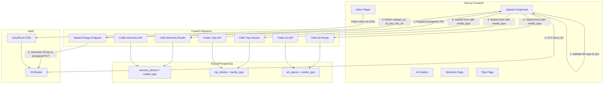

# Design Document: Video Upload Support

## Overview

This design extends the existing media infrastructure to support video uploads (MP4 and WebM) alongside photos across the Art, Moments, and Trips sections. The approach reuses the existing S3 presigned URL + CloudFront CDN pattern, adding a `media_type` discriminator column to distinguish photos from videos at the database level, and updating both backend APIs and frontend components to handle video content types, size limits, and playback.

**Key Design Decisions:**

1. **Reuse existing presign endpoint pattern** — A new `/api/cms/media/presign` endpoint handles video presigning with the same flow as photos, keeping the architecture consistent.
2. **Discriminator column over separate tables** — Adding a `media_type` column to existing photo tables avoids schema duplication and keeps queries simple. Videos and photos share the same positional ordering within a parent entity.
3. **Client-side file validation** — File type and size validation happens in the browser before any network request, providing immediate feedback and avoiding unnecessary presign calls.
4. **Native HTML5 video player** — No third-party video player library; the native `<video>` element with controls provides accessible playback with minimal bundle impact.

## Architecture



**Upload Flow (unchanged pattern, extended for video):**

1. User selects a file in the Upload Component
2. Client validates: file type (image/jpeg, image/png, video/mp4, video/webm), file size (10 MB photos, 100 MB videos), non-zero bytes
3. Client requests a presigned URL from the backend, passing `content_type`
4. Backend validates content type, generates S3 key under `photos/` or `videos/` prefix, returns presigned PUT URL + CDN URL
5. Client uploads directly to S3 using the presigned URL
6. Client submits the form with `s3_key`, `cdn_url`, `position`, and `media_type`

## Components and Interfaces

### Backend Components

#### 1. Media Presign Endpoint (`/api/cms/media/presign`)

New endpoint that extends the existing photo presign to also accept video content types.

```python
# Allowed content types and their file extensions + S3 prefix
_ALLOWED_CONTENT_TYPES: dict[str, tuple[str, str]] = {
    "image/jpeg": ("jpg", "photos"),
    "image/png": ("png", "photos"),
    "video/mp4": ("mp4", "videos"),
    "video/webm": ("webm", "videos"),
}

@router.post("/api/cms/media/presign")
def presign_media_upload(body: PresignRequest) -> PresignResponse:
    # Validates content_type against allowed types
    # Generates S3 key: {prefix}/{year}/{uuid4}.{ext}
    # Returns presigned PUT URL (900s expiry), s3_key, cdn_url
```

The existing `/api/cms/photos/presign` endpoint remains unchanged for backward compatibility but the frontend will migrate to the new endpoint.

#### 2. Updated Pydantic Schemas

```python
# Input schemas gain media_type field
class MomentPhotoIn(BaseModel):
    s3_key: str
    cdn_url: str
    position: int = Field(ge=1, le=2)
    media_type: Literal["photo", "video"] = "photo"

class TripPhotoIn(BaseModel):
    s3_key: str
    cdn_url: str
    position: int = Field(ge=1, le=20)
    media_type: Literal["photo", "video"] = "photo"

class ArtPieceCreate(BaseModel):
    year: int = Field(ge=2020)
    s3_key: str
    cdn_url: str
    title: str | None = Field(default=None, max_length=200)
    media_type: Literal["photo", "video"] = "photo"

# Output schemas gain media_type field
class MomentPhotoOut(BaseModel):
    cdn_url: str
    position: int
    media_type: str

class TripPhotoOut(BaseModel):
    cdn_url: str
    position: int
    media_type: str

class ArtPieceOut(BaseModel):
    id: int
    cdn_url: str
    title: str | None = None
    position: int
    media_type: str
```

#### 3. Updated CMS Routers

The CMS routers for Moments, Trips, and Art are updated to:
- Accept `media_type` in create/update payloads
- Store `media_type` in the database
- Return `media_type` in responses
- Delete S3 objects for both photos and videos on entity deletion

No logic changes are needed for S3 deletion — the existing `_delete_s3_key` function works regardless of whether the key points to a photo or video.

#### 4. Updated Public API Routers

Public API responses include `media_type` so the frontend can render the appropriate element (img vs video).

### Frontend Components

#### 1. MediaUpload Component (refactored from PhotoUpload/PhotoUploader)

Extended to accept video files alongside photos:

```typescript
interface MediaData {
  s3_key: string;
  cdn_url: string;
  position: number;
  media_type: "photo" | "video";
}

const ALLOWED_TYPES = {
  "image/jpeg": { ext: "jpg", maxSize: 10 * 1024 * 1024 },
  "image/png": { ext: "png", maxSize: 10 * 1024 * 1024 },
  "video/mp4": { ext: "mp4", maxSize: 100 * 1024 * 1024 },
  "video/webm": { ext: "webm", maxSize: 100 * 1024 * 1024 },
};

// Extension fallback mapping for empty MIME types
const EXT_TO_CONTENT_TYPE: Record<string, string> = {
  jpg: "image/jpeg",
  jpeg: "image/jpeg",
  png: "image/png",
  mp4: "video/mp4",
  webm: "video/webm",
};
```

Key behaviors:
- Validates file type by MIME or extension fallback
- Applies size limit based on media type (10 MB photos, 100 MB videos)
- Rejects 0-byte files
- Shows video icon overlay on video thumbnails in the grid
- Uses static placeholder for video preview (no inline playback in upload grid)

#### 2. VideoPlayer Component

A reusable component for public pages:

```typescript
interface VideoPlayerProps {
  src: string;
  alt?: string;
  className?: string;
}

function VideoPlayer({ src, alt, className }: VideoPlayerProps) {
  // Renders <video> with controls, no autoplay
  // Shows fallback message on error
  // Keyboard accessible (native controls)
}
```

#### 3. Updated Gallery/Detail Pages

- **Moments detail page**: Renders `<video>` for items with `media_type === "video"`, `` for photos
- **Trips detail page**: Same conditional rendering in the PhotoGallery component
- **Art gallery page**: Renders `<video>` in the grid for video art pieces, with poster frame or placeholder

### Database Migration

A single Alembic migration adds `media_type` column to three tables:

```python
def upgrade():
    op.add_column("moment_photos", sa.Column("media_type", sa.String(10), nullable=False, server_default="photo"))
    op.add_column("trip_photos", sa.Column("media_type", sa.String(10), nullable=False, server_default="photo"))
    op.add_column("art_pieces", sa.Column("media_type", sa.String(10), nullable=False, server_default="photo"))

def downgrade():
    op.drop_column("moment_photos", "media_type")
    op.drop_column("trip_photos", "media_type")
    op.drop_column("art_pieces", "media_type")
```

## Data Models

### Updated SQLAlchemy Models

```python
class MomentPhoto(Base):
    __tablename__ = "moment_photos"
    id: Mapped[int] = mapped_column(Integer, primary_key=True, autoincrement=True)
    moment_id: Mapped[int] = mapped_column(Integer, ForeignKey("moments.id", ondelete="CASCADE"), nullable=False)
    s3_key: Mapped[str] = mapped_column(String(512), nullable=False)
    cdn_url: Mapped[str] = mapped_column(String(1024), nullable=False)
    position: Mapped[int] = mapped_column(Integer, nullable=False)
    media_type: Mapped[str] = mapped_column(String(10), nullable=False, server_default="photo")
    created_at: Mapped[datetime] = mapped_column(DateTime, nullable=False, default=_now)
    moment: Mapped["Moment"] = relationship("Moment", back_populates="photos")

class TripPhoto(Base):
    __tablename__ = "trip_photos"
    id: Mapped[int] = mapped_column(Integer, primary_key=True, autoincrement=True)
    trip_id: Mapped[int] = mapped_column(Integer, ForeignKey("trips.id", ondelete="CASCADE"), nullable=False)
    s3_key: Mapped[str] = mapped_column(String(512), nullable=False)
    cdn_url: Mapped[str] = mapped_column(String(1024), nullable=False)
    position: Mapped[int] = mapped_column(Integer, nullable=False)
    media_type: Mapped[str] = mapped_column(String(10), nullable=False, server_default="photo")
    created_at: Mapped[datetime] = mapped_column(DateTime, nullable=False, default=_now)
    trip: Mapped["Trip"] = relationship("Trip", back_populates="photos")

class ArtPiece(Base):
    __tablename__ = "art_pieces"
    id: Mapped[int] = mapped_column(Integer, primary_key=True, autoincrement=True)
    year: Mapped[int] = mapped_column(Integer, nullable=False, index=True)
    title: Mapped[str | None] = mapped_column(String(200), nullable=True)
    s3_key: Mapped[str] = mapped_column(String(512), nullable=False)
    cdn_url: Mapped[str] = mapped_column(String(1024), nullable=False)
    position: Mapped[int] = mapped_column(Integer, nullable=False)
    media_type: Mapped[str] = mapped_column(String(10), nullable=False, server_default="photo")
    status: Mapped[str] = mapped_column(String(10), nullable=False, default="draft")
    published_at: Mapped[datetime | None] = mapped_column(DateTime, nullable=True)
    created_at: Mapped[datetime] = mapped_column(DateTime, nullable=False, default=_now)
    updated_at: Mapped[datetime] = mapped_column(DateTime, nullable=False, default=_now, onupdate=_now)
```

### Pydantic Validation Rules

| Field | Constraint |
|-------|-----------|
| `media_type` | `Literal["photo", "video"]`, defaults to `"photo"` |
| Video file size | Max 100 MB (client-side) |
| Photo file size | Max 10 MB (client-side) |
| Video content types | `video/mp4`, `video/webm` |
| Photo content types | `image/jpeg`, `image/png` |
| S3 key pattern (video) | `videos/{year}/{uuid4}.{ext}` |
| S3 key pattern (photo) | `photos/{year}/{uuid4}.{ext}` |

## Correctness Properties

*A property is a characteristic or behavior that should hold true across all valid executions of a system — essentially, a formal statement about what the system should do. Properties serve as the bridge between human-readable specifications and machine-verifiable correctness guarantees.*

### Property 1: Presign key generation correctness

*For any* valid content type in {"image/jpeg", "image/png", "video/mp4", "video/webm"}, the presign endpoint SHALL return an `s3_key` matching the pattern `{prefix}/{current_year}/{uuid4}.{ext}` where prefix is "photos" for images and "videos" for videos, ext matches the content type, and `cdn_url` equals `https://{CLOUDFRONT_DOMAIN}/{s3_key}`.

**Validates: Requirements 1.1, 1.2, 1.3**

### Property 2: Invalid content type rejection

*For any* content type string NOT in {"image/jpeg", "image/png", "video/mp4", "video/webm"}, the presign endpoint SHALL return HTTP 400 with an error message listing the accepted content types.

**Validates: Requirements 1.4**

### Property 3: File size validation by media type

*For any* file with a video content type (video/mp4, video/webm) and size exceeding 100 MB, OR any file with an image content type (image/jpeg, image/png) and size exceeding 10 MB, OR any file with size 0 bytes, the client-side validation function SHALL reject the file and return an appropriate error message.

**Validates: Requirements 2.1, 2.2, 2.4**

### Property 4: media_type default value

*For any* MomentPhoto, TripPhoto, or ArtPiece record created without an explicit media_type value, the stored media_type SHALL equal "photo".

**Validates: Requirements 3.4**

### Property 5: Invalid media_type rejection

*For any* string value that is not "photo" or "video", submitting it as the media_type field in a Moment, Trip, or Art piece create/update request SHALL result in a validation error (HTTP 422).

**Validates: Requirements 3.6, 4.3, 5.3, 6.2**

### Property 6: media_type round-trip preservation

*For any* valid media_type value in {"photo", "video"}, creating a Moment media item, Trip media item, or Art piece with that media_type and then retrieving it via the corresponding API endpoint SHALL return the same media_type value.

**Validates: Requirements 4.1, 4.2, 5.1, 5.2, 6.1, 6.3**

### Property 7: File extension to MIME type fallback

*For any* file with an empty or undefined MIME type and a known extension in {".mp4", ".webm", ".jpg", ".jpeg", ".png"}, the content type resolver function SHALL return the correct MIME type mapping (e.g., ".mp4" → "video/mp4", ".webm" → "video/webm").

**Validates: Requirements 7.3**

### Property 8: Public API media_type inclusion

*For any* published Moment, Trip, or Art piece containing media items, the public API response SHALL include a `media_type` field for each media item with a value of either "photo" or "video".

**Validates: Requirements 8.3, 9.3, 10.3**

## Error Handling

### Backend Error Handling

| Scenario | HTTP Status | Response |
|----------|-------------|----------|
| Invalid content_type in presign request | 400 | `{"detail": "Only image/jpeg, image/png, video/mp4, and video/webm content types are accepted."}` |
| Unauthenticated presign request | 401 | `{"detail": "Not authenticated"}` |
| Invalid media_type in create/update payload | 422 | Pydantic validation error with field details |
| S3 deletion failure during entity delete | Logged, not raised | Operation continues; failure logged at ERROR level |
| S3 deletion failure during entity update | Logged, not raised | Operation continues; failure logged at ERROR level |
| Entity not found (404) | 404 | `{"detail": "{Entity} not found"}` |

### Frontend Error Handling

| Scenario | Behavior |
|----------|----------|
| File type not accepted | Immediate error message: "Only JPEG, PNG, MP4, and WebM files are accepted." |
| Video file exceeds 100 MB | Immediate error message: "Video file size must be 100 MB or less." |
| Photo file exceeds 10 MB | Immediate error message: "Photo file size must be 10 MB or less." |
| File is 0 bytes | Immediate error message: "File is empty." |
| Presign request fails | Error message from API response or generic "Failed to get upload URL" |
| S3 upload fails | Error message: "Failed to upload to storage" |
| Video playback fails | Static fallback message: "Video unavailable" displayed in place of player |
| Empty MIME type on file | Falls back to extension-based detection; rejects if extension unknown |

### Resilience Patterns

- **Best-effort S3 deletion**: All S3 delete operations are wrapped in try/except. Failures are logged but never block the database operation. This prevents orphaned DB records when S3 is temporarily unavailable.
- **Client-side validation first**: File type and size checks happen before any network call, providing instant feedback and reducing unnecessary API load.
- **Graceful video fallback**: If a video CDN URL is unreachable or the format is unsupported by the browser, a static fallback message is shown rather than a broken player.

## Testing Strategy

### Property-Based Tests (Backend — Python/Hypothesis)

The backend already has `hypothesis>=6.100.0` as a dev dependency. Property-based tests will use Hypothesis to validate the correctness properties.

**Configuration:**
- Minimum 100 examples per property test (Hypothesis default `max_examples=100`)
- Each test tagged with: `# Feature: video-upload-support, Property {N}: {description}`
- Tests located in `backend/tests/test_video_upload_properties.py`

**Properties to implement:**
1. Presign key generation correctness — generate random valid content types, verify key pattern and CDN URL structure
2. Invalid content type rejection — generate random strings not in allowed set, verify 400 response
3. media_type default value — create records without media_type, verify default
4. Invalid media_type rejection — generate random non-"photo"/"video" strings, verify 422
5. media_type round-trip — create with valid media_type, read back, verify equality
6. Public API media_type inclusion — create published entities with media, verify public response includes media_type

### Property-Based Tests (Frontend — Vitest + fast-check)

The frontend uses Vitest. Add `fast-check` as a dev dependency for property-based testing.

**Properties to implement:**
7. File size validation — generate random file sizes and types, verify correct accept/reject behavior
8. Extension-to-MIME fallback — generate known extensions with empty MIME, verify correct mapping

### Unit Tests (Example-Based)

**Backend:**
- Presign endpoint returns 401 without auth
- CMS trip detail endpoint includes media_type in response
- S3 deletion is attempted for both photos and videos on entity delete (mocked S3)
- S3 deletion failures don't block entity deletion

**Frontend:**
- Video icon overlay renders for video media items
- Static placeholder renders for video items in upload grid
- `<video>` element renders with `controls` attribute and without `autoplay`
- Video error event triggers fallback message display
- Video player is keyboard-accessible (focusable)

### Integration Tests

- Alembic migration applies cleanly to a database with existing rows (all get media_type="photo")
- Alembic downgrade removes media_type columns without affecting other data
- Full upload flow: presign → S3 upload → create entity with media_type → retrieve via public API
- Entity deletion triggers S3 delete attempts for all associated media (mocked S3)

### Smoke Tests

- Migration file has correct `down_revision` linking to previous migration
- media_type column exists on all three tables after migration
- Presign endpoint is reachable and returns expected response shape

